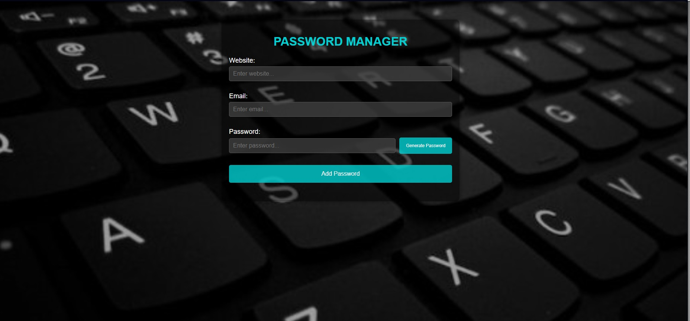
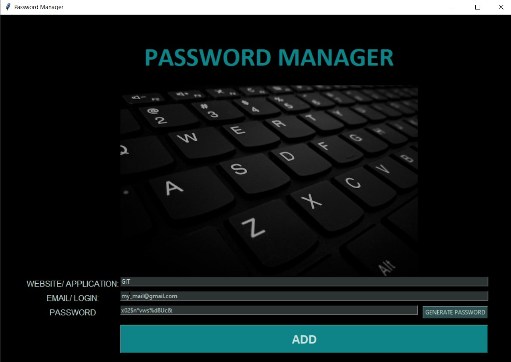
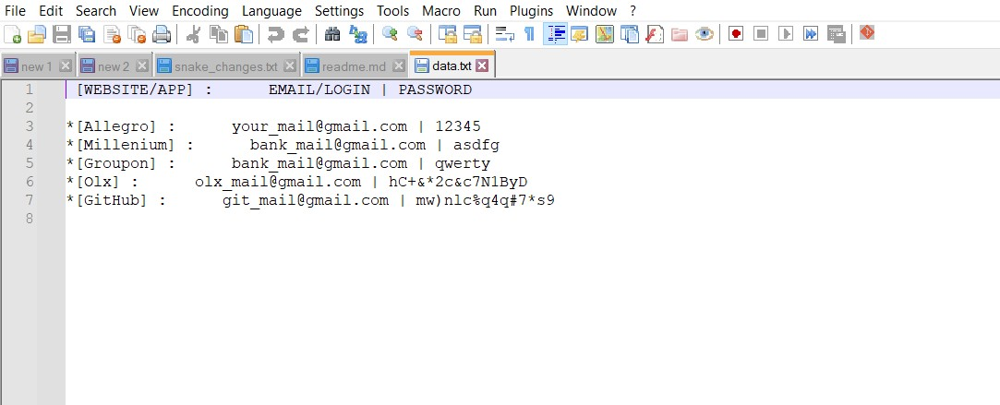

# Password Generator
## 2 types of application: 
- Severless application (AWS Lambda+ AWS DynamoDB)
- Application with UI created with Tkinter package (save data to txt file)

# Live demo 
[rockpiryt.link](https://rockpiryt.link)

## Table of Contents
* [General Info](#general-information)
* [Technologies Used](#technologies-used)
* [Features](#features)
* [Screenshots](#screenshots)
* [Setup](#setup)
* [Project Status](#project-status)
* [Contact](#contact)

## General Information

### The serverless application empowers users to manage their passwords effectively. Users have the option to input their own passwords or automatically generate a random one. Data are saved in AWS DynamoDB.

### The application with UI created with Tkinter empowers users to manage their passwords effectively. Users have the option to input their own passwords or automatically generate a random one. Data are saved in txt file.

## Technologies Used
- Python 3.11
- Pyperclip 1.8.2
- AWS Lambda Functions
- AWS DynamoDB

## Features
> The serverless application:
List the ready features here:
- One Lambda function is dedicated to generating random passwords
- Second Lambda function is tasked with saving data from the form to DynamoDB.

## Screenshots
 The serverless application:

 The application with UI created with Tkinter:

## Setup

1. Clone This Project git clone
2. Enter Project Directory cd PASSWORD_GENERATOR
3. Create a Virtual Environment (for Windows) py -m venv (name your virtual enviroment :) venv

   EXAMPLE: py -m venv venv
4. Activate Virtual Environment source: venv/Scripts/activate
5. Install Requirements Package pip install -r requirements.txt
6. Finally Run The Project: python main.py

## Project Status
Project is: _in progress_ 

## Contact
- Created by [@RockPiryt Github](https://github.com/RockPiryt)
- My Resume [@RockPiryt Resume](https://paulinakimak.com)

Feel free to contact me!

